# Instituto Tecnológico de Oaxaca
---
## Materia: Programación Web  
## Actividad 5 Proyecto de Login
---
## Integrantes del Equipo:

Espinoza de la Rosa Uriel

Nava Peralta Kevin Peralta

**Fecha:** 07 de Octubre de 2026

## Equipo 9

# Descripción Breve del Proyecto

Aplicación web de dos pantallas (inicio de sesión y módulo de captura) hecha con HTML, CSS, JavaScript y Bootstrap. 
 
---
 
## Tecnologías y framework CSS
 
| Tecnología | Uso |
|---|---|
| **Bootstrap 5** (framework CSS) | Formularios, validación visual, grid, modal, dropdown y submenú colapsable |
| **CSS** (`login.css`, `index.css`) | Diseño del login dividido, barra lateral, colores, tipografía y adaptación a celular |
| **JavaScript** | Validaciones, manejo de sesión y lógica de los formularios |
| **IBM Plex Sans** (Google Fonts) | Tipografía de ambas pantallas |
| **localStorage** | Guarda el usuario que inició sesión |
 
### Cómo se usa Bootstrap
 
Bootstrap se carga desde la carpeta local `bootstrap/` y se usa **como base**. Las clases de Bootstrap se integran a la estructura y el comportamiento, y el CSS ajusta el aspecto.
 
- **Desde Bootstrap:** `form-label`, `form-control`, `form-text`, `input-group`, `d-grid`, `is-invalid` / `invalid-feedback`, `card`, `modal`, `dropdown`, `collapse`, `row` / `col-lg-6`.
- **Desde CSS:** la pantalla dividida del login, la barra lateral que se oculta y se muestra, la paleta azul institucional, los botones (`.btn-login`, `.btn-accion`) y los estados del modal.
- **JavaScript de Bootstrap** (`bootstrap.bundle.min.js`): solo se necesita en `index.html`, para el modal, el dropdown del usuario y el submenú.
---
 
## Estructura del proyecto
 
```
proyecto/
├── login.html          Pantalla de inicio de sesión
├── index.html          Módulo de captura (sistema)
├── bootstrap/          Framework CSS y JS
├── css/
│   ├── login.css       Estilos del login
│   └── index.css       Estilos del sistema (sidebar, navbar, tarjetas, modal)
├── js/
│   ├── login.js        Lógica del login
│   └── index.js        Lógica del sistema
└── docs/
    └── capturas/       Capturas de pantalla para este README
```
 
---

## Cómo fluye el login hacia el sistema
 
```
login.html ──► login.js valida los campos
                    │
          ¿usuario y contraseña válidos?
             │ No                      │ Sí
             ▼                         ▼
   Muestra errores en cada     Guarda "usuarioActivo" en localStorage
   campo y se queda aquí                │
                                        ▼
                               Redirige a index.html
                                        │
                                        ▼
                      index.js revisa localStorage al cargar
                             │ No existe        │ Existe
                             ▼                  ▼
                   Regresa a login.html   Muestra el sistema con el
                                          nombre en el navbar
                                                │
                                      "Cerrar sesión"
                                                ▼
                              Borra "usuarioActivo" y vuelve a login.html
```
 
### Reglas del login
 
**Usuario o correo** (se recortan los espacios al inicio y al final):
- No puede estar vacío.
- Si contiene `@`, debe ser un correo válido (`validarCorreo`).
- Si no contiene `@`, debe tener al menos 3 caracteres y no llevar espacios.
**Contraseña** (`validarPassword`): mínimo 8 caracteres, con mayúscula, minúscula, número y un carácter especial.
 
---
 
## 5. Cómo se pasa el nombre de usuario al navbar
 
El nombre viaja de una página a otra mediante **`localStorage`**, que conserva datos en el navegador aunque se cambie de página.
 
**En `login.js`**, cuando el login es válido:
 
```javascript
// Si es correo toma lo anterior al @; si no, usa el usuario tal cual
const base = username.includes('@') ? username.split('@')[0] : username;
const nombreUsuario = capitalizarPalabras(base);
 
localStorage.setItem('usuarioActivo', nombreUsuario);
window.location.href = 'index.html';
```
 
**En `index.js`**, al cargar el sistema:
 
```javascript
const usuarioGuardado = localStorage.getItem('usuarioActivo');
 
if (usuarioGuardado) {
    document.getElementById('nombreUsuarioNavbar').textContent = usuarioGuardado;
} else {
    window.location.replace('login.html');
}
```
 
Ejemplo: se escribe `admin@gmail.com` → se guarda `Admin` → el navbar muestra **Admin**.
 
Si alguien abre `index.html` sin haber iniciado sesión, `localStorage` no tiene el dato y el sistema lo regresa al login.

---
 
## Métodos principales
 
### `js/utileria.js`
 
| Función | Qué hace | Se usa en |
|---|---|---|
| `validarCorreo(correo)` | Revisa el formato `usuario@dominio.ext` con una expresión regular | Login y captura de usuarios |
| `validarPassword(password)` | Exige 8+ caracteres, mayúscula, minúscula, número y carácter especial | Login y captura de usuarios |
| `soloLetras(texto)` | Acepta solo letras (con acentos y ñ) y espacios | Nombres de usuario y alumno |
| `capitalizarPalabras(texto)` | Pone la primera letra de cada palabra en mayúscula | Nombres y nombre del navbar |
| `formatearTelefono(telefono)` | Si tiene 10 dígitos devuelve `(XXX) XXX-XXXX`; si no, `null` | Captura de usuarios |
| `validarLongitud(numero, max)` | Cuenta los dígitos y verifica que no pasen del máximo | Número de control |
| `calcularEdad(fecha)` | Calcula la edad en años cumplidos | Captura de alumnos |
| `esMayorDeEdad(fecha)` | Devuelve `true` si la edad es 18 o más | Modal de resultado |
 
### `js/login.js`
 
| Función / evento | Qué hace |
|---|---|
| `validarUsuario(valor)` | Decide si el usuario es válido (correo o usuario simple) y devuelve el mensaje de error |
| `validarClave(valor)` | Valida la contraseña con `validarPassword` y devuelve el mensaje de error |
| `mostrarError()` / `limpiarError()` | Marcan o quitan el error rojo de un campo |
| Evento `submit` del formulario | Valida, guarda la sesión y redirige |
| Botón "Mostrar / Ocultar" | Cambia el tipo del campo entre `password` y `text` |
 
### `js/index.js`
 
| Función / evento | Qué hace |
|---|---|
| Lectura de `usuarioActivo` | Pone el nombre en el navbar o regresa al login |
| `#btn-cerrar-sesion` (click) | Borra `usuarioActivo` de `localStorage` |
| `#menu-toggle` (click) | Muestra u oculta la barra lateral con la clase `toggled` |
| `mostrarError()`, `limpiarErrores()`, `enfocarPrimerError()` | Manejo de errores por campo en ambos formularios |
| `fechaLocal(valor)` | Convierte `"YYYY-MM-DD"` a fecha local para evitar un desfase de un día por zona horaria |
| `submit` de `form-usuarios` | Valida nombre, correo, teléfono y contraseña |
| `submit` de `form-alumnos` | Valida nombre, número de control y fecha; abre el modal con el resultado |
 
---

## Proceso de creación paso a paso
 
### Funciones de validación (`utileria.js`)
 
Antes de hacer las pantallas, se escribieron las validaciones en un solo archivo para reutilizarlas. Así, el login y el sistema validan el correo y la contraseña con el mismo código.
 
### Login
 
1. **HTML:** formulario con los campos `username` y `password`, cada uno con un `div.invalid-feedback` para su mensaje de error. Se agregó `novalidate` al formulario para que los mensajes sean los del proyecto y no los del navegador.
2. **Validación:** al enviar el formulario se llama a `validarUsuario` y `validarClave`. Si hay error, se marca el campo con `is-invalid` y se enfoca el primero con problema.
3. **Sesión:** si todo es válido, se guarda `usuarioActivo` en `localStorage` y se redirige a `index.html`.

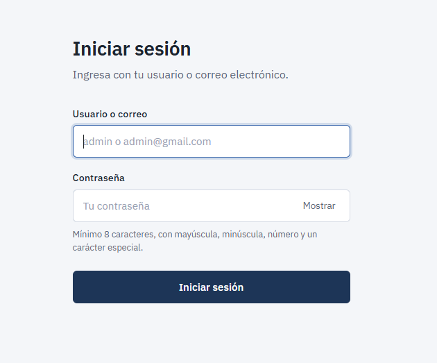

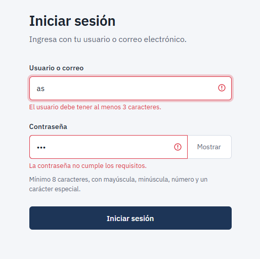
 
### Barra lateral (sidebar)
 
La barra lateral y el contenido van dentro de un contenedor `d-flex`. Para ocultarla se usa un margen negativo, y la clase `toggled` la muestra u oculta:
 
```css
#sidebar-wrapper {
    width: 15rem;
    margin-left: -15rem;           /* oculta en celular */
    transition: margin 0.25s ease-out;
}
#wrapper.toggled #sidebar-wrapper { margin-left: 0; }
 
@media (min-width: 768px) {
    #sidebar-wrapper { margin-left: 0; }                      /* visible en escritorio */
    #wrapper.toggled #sidebar-wrapper { margin-left: -15rem; } /* el botón la oculta */
}
```
 
```javascript
menuToggle.addEventListener('click', function (e) {
    e.preventDefault();
    wrapper.classList.toggle('toggled');
});
```
 
El grupo "Usuarios" es un submenú colapsable de Bootstrap (`data-bs-toggle="collapse"`).
 
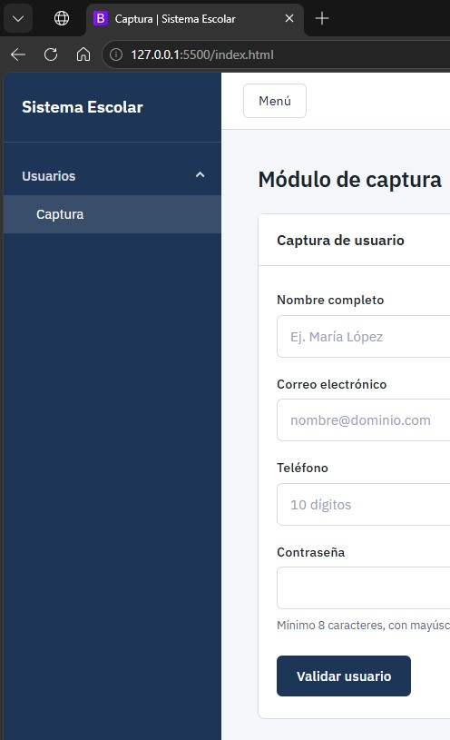

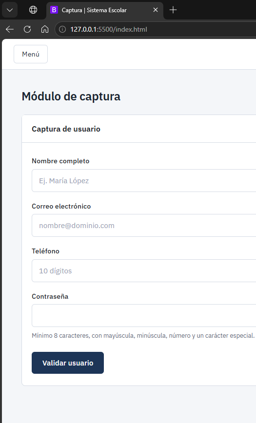
 
### Navbar con el usuario
 
1. Se agregó una barra superior con el botón de menú y un dropdown de Bootstrap con el nombre del usuario.
2. El `id="nombreUsuarioNavbar"` es el elemento donde `index.js` escribe el nombre guardado por el login.
3. "Cerrar sesión" borra `usuarioActivo` y redirige a `login.html`.

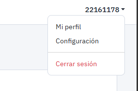


### Captura de usuarios
 
Formulario con nombre, correo, teléfono y contraseña. Cada campo usa su función de `utileria.js`. Al salir del campo de nombre se aplica `capitalizarPalabras`, y al salir del de teléfono se aplica `formatearTelefono`. Si todo es válido, aparece un recuadro verde con los datos.
 
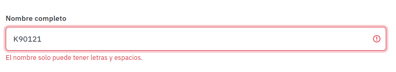
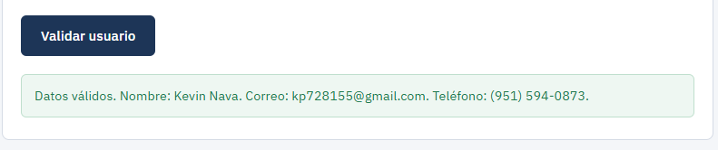
 
### Número de control
 
La validación se hace por etapas, y cada una tiene su propio mensaje:
 
```javascript
if (numControl === '') {
    mostrarError(inputNumControl, 'Ingresa el número de control.');
} else if (!/^\d+$/.test(numControl)) {
    mostrarError(inputNumControl, 'Solo se permiten números.');
} else if (!validarLongitud(numControl, 8)) {
    mostrarError(inputNumControl, 'No puede tener más de 8 dígitos.');
} else if (numControl.length < 8) {
    mostrarError(inputNumControl, 'Debe tener exactamente 8 dígitos.');
}
```
 
`validarLongitud` comprueba el máximo, y la revisión de `length` asegura el mínimo, así que el número debe tener exactamente 8 dígitos.
 
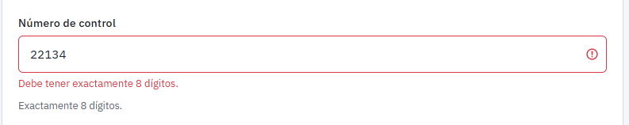
 
### Paso 8. Modal de resultado
 
Para el alumno se pide la **fecha de nacimiento**. Con ella, `calcularEdad` obtiene la edad y `esMayorDeEdad` decide el mensaje. El modal es un componente de Bootstrap que se abre desde JavaScript:
 
```javascript
const modalEdad = new bootstrap.Modal(document.getElementById('modalEdad'));
 
// ...al validar correctamente:
resumenModal.textContent = nombre + ', número de control ' + numControl + ', ' + edad + ' años.';
mensajeModal.textContent = esMayor ? 'El alumno es mayor de edad.' : 'El alumno es menor de edad.';
modalEdad.show();
```
 
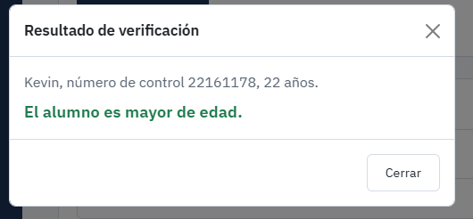

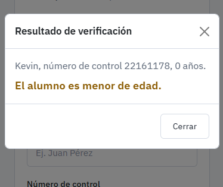
 
---
 
## 8. Capturas del flujo completo
 
Recorrido completo, en orden:
 
| # | Pantalla | Captura |
|---|---|---|
| 1 | Login |  |
| 2 | Login con errores |  |
| 3 | Sistema después de iniciar sesión | 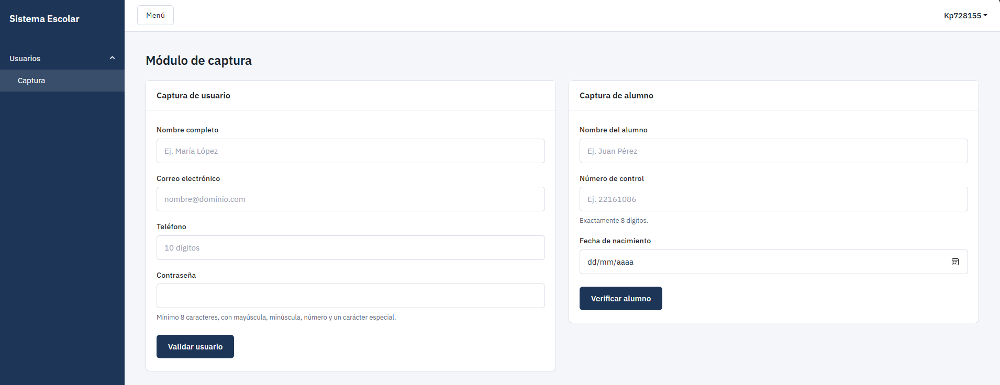 |
| 4 | Captura de usuarios válida |  |
| 5 | Captura de alumnos con errores | 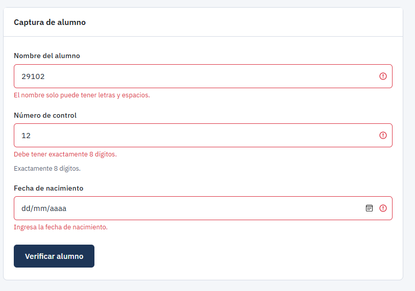 |
| 6 | Modal de resultado |  |
| 7 | Cerrar sesión (de regreso en el login) |  |
